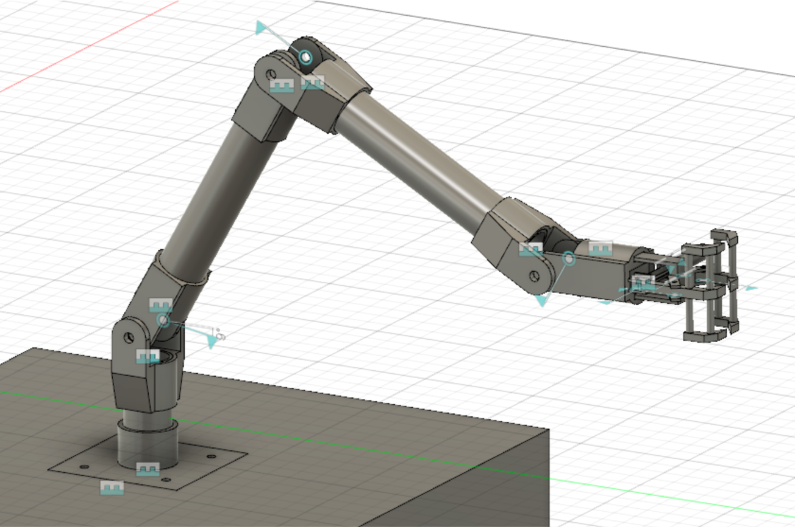
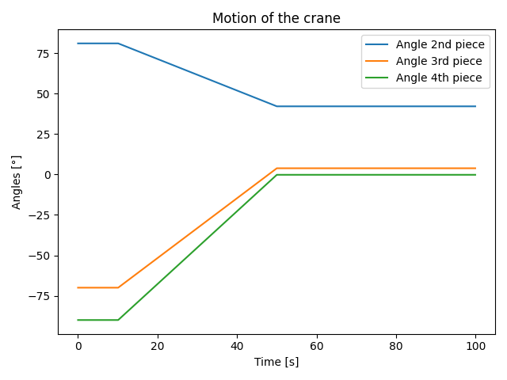
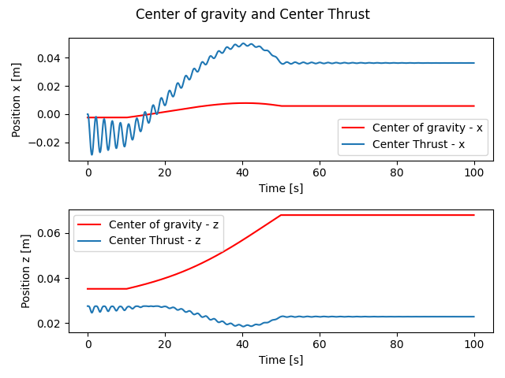
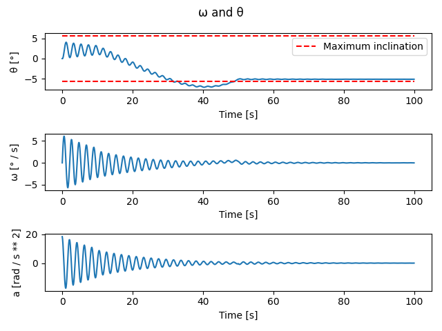
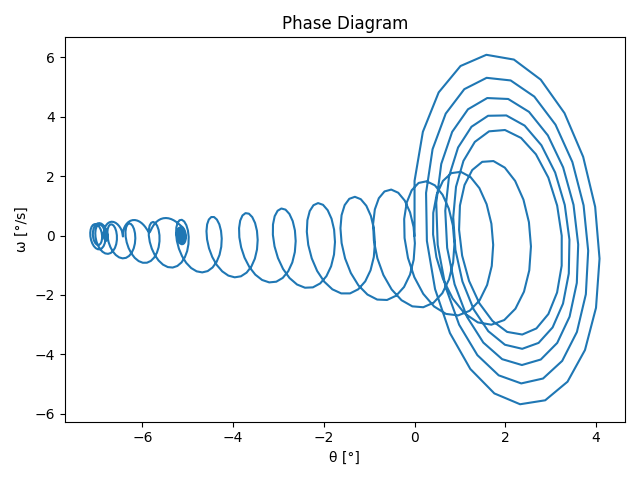

# LEPL1501
Modélisation de la grue du groupe 11.57 dans le cadre du cours Projet LEPL1501 du premier quadrimestre 2020 en ingénieur 
civil.
Dans le cadre de ce projet, il faut concevoir une grue flottante permettant de construire une éolienne en mer. 
Cette grue a d'abord été modéliser sur un logiciel de développement 3D appelé *[Fusion 360](https://www.autodesk.com/products/fusion-360/overview)*.

Le programme python ci-dessus à pour but de modéliser mathématiquement le comportment de cette grue. 

## Donnée à entrer

Cette section est consacrée aux variables à rentrer pour les calculs. Le choix des différentes variales ce fait dans le 
fichier ```variables.py```. 

- les coordonées en x, y et z et leurs angles avec l'horizontale des différentes pièces de la grue :
    - grappin
    - contrepoid
    - les sections / bras de la grue :
        - section 1
        - section 2
        - section 3
        - section 4
    - la pièce déplacée             

- les masses des différentes pièces de la grue
- les différentes constantes :
    - gravité
    - inertie
    - coeficiant d'amortissement

## Données sorties par le programme 

Cette section est consacrée aux données sorties par le programme.

- les graphiques :
             - de l'angle en fonction du temps
             - la vitesse angulaire en fonction du temps
             - l'accélération en fonction du temp
             - du diagramme de phase
             - des coordonées du centre de gravité et de poussée du système en fontion du temps
             - les différentes énergies du système en fonction du temps

    
## Conclusion

### Evolution :

Le programe à connu deux phase : 
- une première avec des équations approximative ne prenant pas en compte  l'inertie de la barge (voir le projet : https://github.com/Nimbelungen/projet1-1157)
- puis une évolution prenant en compte tout les paramètres possibles

### Temps : 

Les différents programmeurs ont mit plusieur jour pour en arriver là, le programme fonctionne bien

### Modèle de grue utilisé :

Le modèle utilisé pour le grue est un bras mécanique géant. 
