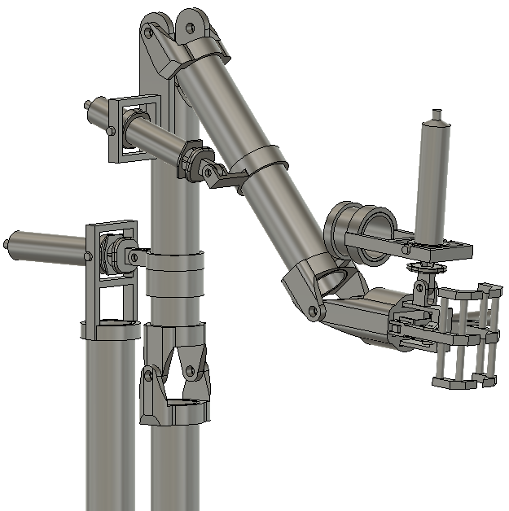

# LEPL1501
Modélisation de la grue du groupe 11.57 dans le cadre du cours Projet LEPL1501 du premier quadrimestre 2020 en ingénieur Civil.
Dans le cadre de ce projet, il faut concevoir une grue flottante permettant de construire une éolienne en mer.
Cette grue a d'abord été modélisée sur un logiciel de développement 3D appelé *[Fusion 360](https://www.autodesk.com/products/fusion-360/overview)*.

Le programme python ci-dessus a pour but de modéliser mathématiquement le comportement de cette grue.

## Données à entrer

Cette section est consacrée aux variables à rentrer pour les calculs. Le choix des différentes variables se fait dans le
fichier ```variables.py```.

- Quelques constantes
    - L'inertie
    - L'accélération gravitationnelle
    - L'amortissement
    - Facteurs de convertions degrés -> radians et vice versa
- Les données de la barge
    - Masse
    - Dimensions
    - Coordonées du centre de gravité
- La grue
    - Masse
    - Coordonées du de gravité
- Le contrepoids
    - Masse
    - Coordonées du de gravité

## Données sorties par le programme 


Cette section est consacrée aux données sorties par le programme. Les graphiques sont créées en 2 phases :
- ```calculation.py``` : Applications de calculs, résolution des équations et création des listes utilisées pour dessiner les graphs
- ```graph.py``` : création et enregistrement des graphiques

Les graphiques sont :
- L'angle en fonction du temps
- La vitesse angulaire en fonction du temps
- L'accélération en fonction du temps
- Le diagramme de phase
- Les coordonnées du centre de gravité et de poussée du système en fonction du temps
- Les différentes énergies du système en fonction du temps

</img> 
</img> 
</img> 
</img> 
</img> 


## Conclusion

### Evolution :
Le programme à connu deux phases :
- Une première avec des équations approximative ne prenant pas en compte l'inertie de la barge ([voir le projet](https://github.com/Nimbelungen/projet1-1157)).
- Puis une évolution prenant en compte tous les paramètres possibles et a été u fur et à mesure amélioré au cours du temps.

### Temps : 
Les différents programmeurs ont mis plusieurs mois pour en arriver là. Aujourd'hui le programme fonctionne bien.

### Modèle de grue utilisé :
Le modèle utilisé pour la grue est un bras mécanique géant.

#### Attention 
Le programme ne prend pas en compte le vent, la force des vagues et autres élément naturels dût à la pleine mer lors de la simulation
